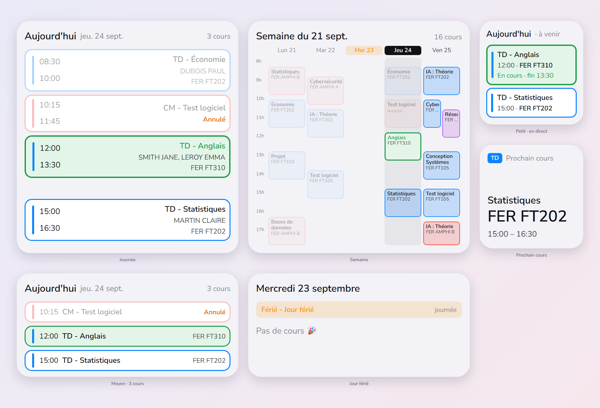
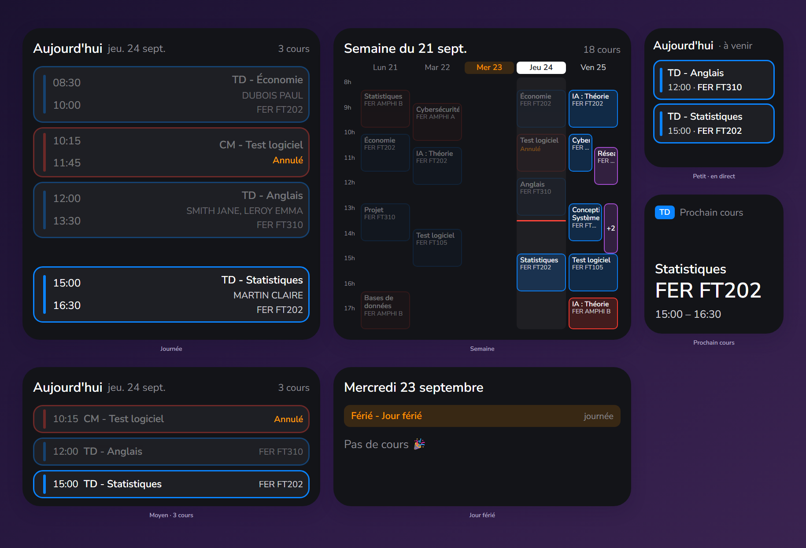
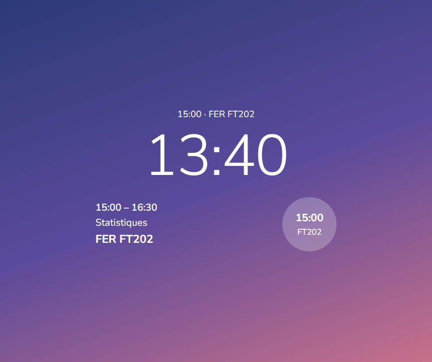

# cy-edt-widget

Widget iOS **non officiel** (via [Scriptable](https://scriptable.app)) pour l'emploi du temps CELCAT de **CY Tech / CY Cergy Paris Université** (`celcat-calendar.cyu.fr`).

Tes cours directement sur l'écran d'accueil : horaires, salles, type de cours, cours annulés, notifications de changement et synchronisation avec le calendrier iPhone.

> Projet indépendant, sans aucun lien avec CY Tech / CYU. Tes identifiants restent sur ton iPhone.



<details>
<summary>Mode sombre et écran verrouillé</summary>





</details>

*Aperçus réalisés avec des données fictives : cours, salles et enseignants inventés. Page source : [`docs/preview.html`](docs/preview.html).*

---

## Fonctionnalités

- **Vue du jour** — cours du jour (ou du prochain jour de cours), cartes sombres/claires avec bordure colorée par type : CM rouge, TD bleu, TP vert, examen orange.
- **Mode live** (petit widget) — chaque cours disparaît 30 min après son début pour laisser la place au suivant et à sa salle.
- **Vue semaine** — planning de la semaine sur un grand widget (trait rouge sur l'heure courante), avec possibilité d'afficher les semaines suivantes.
- **Prochain cours** — seulement le cours suivant et sa salle ; c'est aussi l'affichage automatique sur l'écran verrouillé.
- **Cours annulés** grisés au lieu d'être masqués ; **fériés et vacances** affichés en bandeau, sans horaire ni rappel.
- **Notifications** si l'emploi du temps change (salle, horaire, annulation, ajout) sur les 7 prochains jours.
- **Rappel** 10 min avant chaque cours, avec la salle.
- **Synchronisation calendrier** dans un calendrier iPhone dédié (« Cours CY »).
- **Mode clair / sombre** automatique.
- **Cache hors ligne** : les données sont réutilisées si le réseau est indisponible, et aucun appel réseau n'est fait la nuit (22h → 7h). En cas de panne réseau ou serveur, les tentatives sont espacées progressivement.
- **Protection du compte CY** : si CELCAT refuse les identifiants, le widget s'arrête **dès la première tentative** et ne renvoie plus jamais le mot de passe — sinon il le rejouerait toutes les 15 min et l'annuaire CY finirait par bloquer le compte. L'emploi du temps déjà téléchargé reste affiché, avec le badge « identifiants ✗ ». Le verrou saute dès que l'identifiant ou le mot de passe est modifié (ou via « Débloquer et réessayer une fois » dans le menu).

## Installation

1. Installer **Scriptable** depuis l'App Store.
2. Copier le contenu de [`celcat-widget.js`](celcat-widget.js).
3. Dans Scriptable : `+` → coller le script → le nommer par ex. `EDT CY`.
4. **Lancer le script une fois dans l'app** et choisir « Changer mes identifiants » :
   - identifiant et mot de passe CY (ceux de `celcat-calendar.cyu.fr`) ;
   - numéro étudiant = le nombre après `fid0=` dans l'URL de ton emploi du temps (tu peux coller l'URL entière, ou laisser vide pour tenter la détection automatique).
   Tout est stocké dans le **Trousseau iOS**.
5. Choisir « Tester les notifications » une fois, pour autoriser Scriptable à en envoyer.
6. Ajouter un widget Scriptable sur l'écran d'accueil (taille **grande** conseillée), puis appui long → **Modifier le widget** → sélectionner le script.

## Choix de la vue (paramètre du widget)

Appui long sur le widget → **Modifier le widget** → champ `Parameter` :

| Paramètre | Affichage |
|---|---|
| *(vide)* ou `0` | Jour actuel, ou prochain jour de cours |
| `1`, `2`, `3`… | Jours de cours suivants (pratique pour une pile de widgets) |
| `semaine` | Vue semaine (grand widget) |
| `semaine 1` | Semaine suivante (`semaine 2`, etc.) |
| `prochain` | Uniquement le prochain cours et sa salle |
| `demo` | Emploi du temps fictif, sans réseau (`demo semaine`, `demo prochain`, `demo 1`… fonctionnent aussi) |

Sur l'**écran verrouillé**, le widget affiche toujours le prochain cours et sa salle, quel que soit le paramètre.

## Mode démo

Le script embarque un emploi du temps fictif : aucun identifiant, aucun appel réseau, rien d'écrit dans le calendrier, aucune notification. De quoi essayer le widget avant de se connecter — et faire des captures sans exposer son vrai planning.

- Dans l'app : lancer le script → entrées **« Démo · … »** (grand, moyen, petit, semaine, prochain cours, écran verrouillé).
- Sur l'écran d'accueil : appui long → **Modifier le widget** → `Parameter` = `demo` (ou `demo semaine`, `demo prochain`…).

## Mises à jour

Le script porte un numéro de version (`const VERSION` en haut du fichier). Le menu propose **« Vérifier les mises à jour »** : il compare cette version à celle publiée sur le dépôt et indique s'il faut recopier le script. Aucune vérification n'est faite depuis un widget.

## Réglages

À modifier en haut de `celcat-widget.js` :

| Constante | Défaut | Rôle |
|---|---|---|
| `DAYS_AHEAD` | `14` | Nombre de jours récupérés |
| `FETCH_MIN` | `15` | Intervalle mini entre deux téléchargements (min) |
| `NIGHT_START` / `NIGHT_END` | `22` / `7` | Plage sans appel réseau |
| `HIDE_AFTER_MIN` | `30` | Mode live : délai avant qu'un cours disparaisse (min) |
| `SHOW_COUNTDOWN` | `false` | Compte à rebours « dans 12:34 » avant un cours |
| `LIVE_FAMILIES` | `["small"]` | Tailles en mode live (ajouter `"medium"` si besoin) |
| `NOTIFY_CHANGES` | `true` | Notifier les changements d'emploi du temps |
| `CHANGES_DAYS` | `7` | Fenêtre de détection des changements (jours) |
| `REMIND_BEFORE_MIN` | `10` | Rappel avant chaque cours (`0` = désactivé) |
| `SYNC_CALENDAR` | `true` | Copier les cours dans le calendrier iPhone |
| `CALENDAR_NAME` | `"Cours CY"` | Nom du calendrier créé |
| `THEME` | `"auto"` | `"auto"`, `"dark"` ou `"light"` |
| `MAX_REMINDERS` | `30` | Plafond de rappels en attente (iOS en autorise 64 pour tout Scriptable) |
| `RENAME` | `{}` | Renommer une matière : `"I2GSIM07": "Statistiques"` |
| `TYPE_COLORS` | — | Couleurs par type de cours (1re règle qui correspond) |

## Menu du script (lancement dans l'app)

Lancer le script depuis Scriptable ouvre un menu :

- aperçus (grand / moyen / petit widget, vue semaine, prochain cours, écran verrouillé) ;
- **Démo · …** : les mêmes aperçus avec l'emploi du temps fictif ;
- **Vérifier les mises à jour** ;
- **Changer mes identifiants** (libère aussi le verrou après un refus) ;
- **Débloquer et réessayer une fois** (proposé uniquement après un refus d'identifiants) ;
- **Tester les notifications** (déclenche la demande d'autorisation iOS) ;
- **Données brutes (debug)** : JSON des premiers cours, utile pour comprendre un affichage bizarre.

## Fonctionnement

1. Connexion via `POST /LdapLogin/Logon` (avec le jeton `__RequestVerificationToken` récupéré sur la page de login).
2. Récupération des cours via `POST /Home/GetCalendarData` (`resType=104`, `federationIds[]=<numéro étudiant>`), du lundi de la semaine courante jusqu'à `DAYS_AHEAD` jours.
3. Mise en cache dans `celcat_cache.json` (dossier Scriptable local) : date de téléchargement, numéro étudiant, version de format, et état d'échec éventuel. L'écriture passe par un fichier temporaire, pour ne jamais laisser un cache tronqué.
4. Affichage, puis, si de nouvelles données ont été téléchargées : diff avec l'ancien planning → notifications, replanification des rappels, mise à jour du calendrier.

Le widget demande à iOS un rafraîchissement au prochain début/fin de cours, et au plus tard après `FETCH_MIN` minutes (iOS reste libre de décaler).

## Problèmes courants

| Symptôme | Piste |
|---|---|
| « Ouvre le script dans Scriptable pour te connecter. » | Lancer le script dans l'app et enregistrer les identifiants. |
| « Identifiants refusés » / badge « identifiants ✗ » | Mot de passe CY changé → « Changer mes identifiants ». Aucune nouvelle tentative de connexion n'est envoyée tant que l'identifiant ou le mot de passe n'a pas changé : c'est ce qui évite de faire bloquer le compte CY. Les cours déjà en mémoire restent affichés. |
| Widget vide ou aucun cours | Numéro étudiant (`fid0`) absent ou erroné → le ressaisir via « Changer mes identifiants ». |
| Une matière s'affiche avec son code | Ajouter une entrée dans `RENAME`. |
| Pas de notifications | Lancer « Tester les notifications » une fois et autoriser Scriptable dans Réglages iOS. |
| Données qui semblent figées | Normal la nuit (22h → 7h) et pendant `FETCH_MIN` minutes ; ouvrir le script force la mise à jour. |
| Affichage inattendu | « Données brutes (debug) » pour inspecter ce que renvoie CELCAT. |

## Vie privée

Identifiants et numéro étudiant sont stockés dans le **Trousseau iOS**. Les cours sont mis en cache localement dans le dossier Scriptable. Le script ne communique qu'avec `celcat-calendar.cyu.fr` — aucun serveur tiers, aucune télémétrie.

## Tests

Le script tourne dans un faux environnement Scriptable (stubs `Request`, `Keychain`, `FileManager`, `Notification`, `Calendar`, `ListWidget`, `DrawContext`…) et les scénarios vérifient le téléchargement, le cache, le backoff, les notifications de changement, la synchro calendrier et le rendu de chaque taille de widget.

```sh
node test/widget.test.js
```

Node ≥ 18, aucune dépendance.

## Licence

[MIT](LICENSE) — © 2026 Sam Procoppe.
