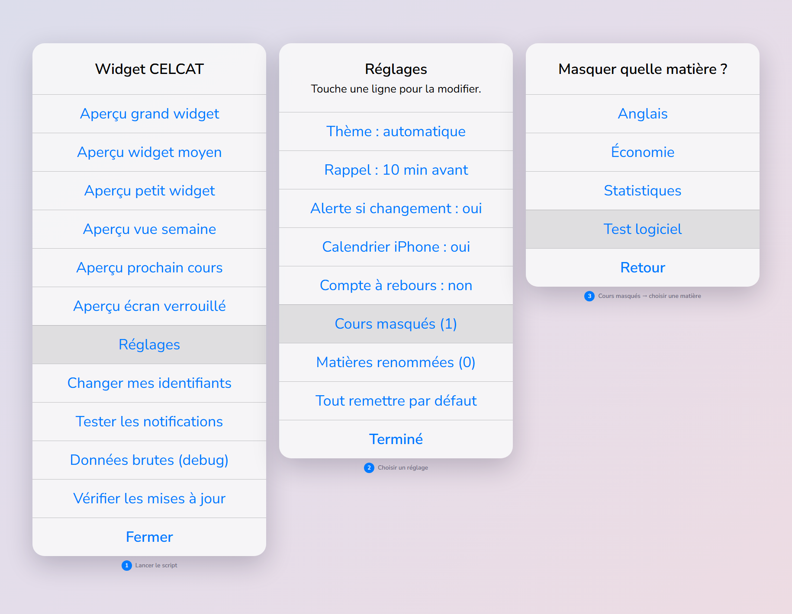

# cy-edt-widget

[](https://github.com/Samito-05/cy-edt-widget/actions/workflows/test.yml)

Widget iOS **non officiel** (via [Scriptable](https://scriptable.app)) pour l'emploi du temps CELCAT de **CY Tech / CY Cergy Paris Université** (`celcat-calendar.cyu.fr`).

Tes cours directement sur l'écran d'accueil : horaires, salles, type de cours, cours annulés, notifications de changement et synchronisation avec le calendrier iPhone.

> Projet indépendant, sans aucun lien avec CY Tech / CYU. Tes identifiants restent sur ton iPhone.


<details>
<summary>Mode sombre et écran verrouillé</summary>


</details>

*Aperçus réalisés avec des données fictives : cours, salles et enseignants inventés. Page source : [`docs/preview.html`](docs/preview.html).*

---

## Fonctionnalités

- **Vue du jour** — cours du jour (ou du prochain jour de cours), cartes sombres/claires avec bordure colorée par type : CM rouge, TD bleu, TP violet, examen orange. Le vert est réservé au cours en cours : une couleur verte envoyée par CELCAT est remplacée par du violet.
- **Mode live** (petit widget) — chaque cours disparaît 30 min après son début pour laisser la place au suivant et à sa salle.
- **Vue semaine** — planning de la semaine sur un grand widget (trait rouge sur l'heure courante), avec possibilité d'afficher les semaines suivantes. Les cours simultanés (groupes, TP en parallèle) s'affichent côte à côte.
- **Prochain cours** — seulement le cours suivant et sa salle ; c'est aussi l'affichage automatique sur l'écran verrouillé.
- **Cours annulés** grisés au lieu d'être masqués ; **fériés et vacances** affichés en bandeau, sans horaire ni rappel.
- **Notifications** si l'emploi du temps change (salle, horaire, annulation, ajout) sur les 7 prochains jours.
- **Rappel** 10 min avant chaque cours, avec la salle.
- **Synchronisation calendrier** dans un calendrier iPhone dédié (« Cours CY »).
- **Mode clair / sombre** automatique.
- **Cours masqués** : une option non suivie ou le cours d'un autre groupe disparaît partout (widget, rappels, calendrier) via `HIDE`.
- **Siri / Raccourcis** : un raccourci qui exécute le script répond en texte avec le prochain cours et sa salle, ou la journée entière.
- **Cache hors ligne** : les données sont réutilisées si le réseau est indisponible, et aucun appel réseau n'est fait la nuit (22h → 7h). En cas de panne réseau ou serveur, les tentatives sont espacées progressivement.
- **Protection du compte CY** : si CELCAT refuse les identifiants, le widget s'arrête **dès la première tentative** et ne renvoie plus jamais le mot de passe — sinon il le rejouerait toutes les 15 min et l'annuaire CY finirait par bloquer le compte. L'emploi du temps déjà téléchargé reste affiché, avec le badge « identifiants ✗ ». Le verrou saute dès que l'identifiant ou le mot de passe est modifié (ou via « Débloquer et réessayer une fois » dans le menu). Le mot de passe ne part qu'une seule fois même si plusieurs widgets se réveillent ensemble, ou si iOS coupe le script avant la réponse. Et si CELCAT change sa page de connexion au point qu'un refus ne soit plus reconnu, le verrou se pose quand même : après **2 envois non confirmés** (réponse jamais reçue, ou connexion « acceptée » sans qu'aucun cours n'arrive), plus rien ne part.

## Installation

> **Prérequis : iOS 16 ou plus.** Les widgets d'écran verrouillé (`accessoryRectangular`,
> `accessoryCircular`, `accessoryInline`) et le marquage « libre / occupé » dans le
> calendrier en dépendent. Sur iOS 15, seuls les widgets d'écran d'accueil fonctionnent.

### Installation rapide (conseillée)

1. Installer **Scriptable** depuis l'App Store.
2. Dans Scriptable : `+` → coller le script d'installation ci-dessous (bouton « copier » en haut à droite du bloc) → ▶︎.

   ```js
   // Installe (ou réinstalle) le widget emploi du temps CY dans Scriptable.
   // Coller dans un nouveau script Scriptable, le lancer, puis le supprimer.
   const NAME = "EDT CY";
   const URL = "https://raw.githubusercontent.com/Samito-05/cy-edt-widget/main/celcat-widget.js";
   let fm = FileManager.local();
   try { if (module.filename.startsWith(FileManager.iCloud().documentsDirectory())) fm = FileManager.iCloud(); } catch (e) {}
   const path = fm.joinPath(module.filename.replace(/\/[^/]*$/, ""), NAME + ".js");
   const req = new Request(URL); req.timeoutInterval = 20;
   const src = await req.loadString();
   if (!/const VERSION = "/.test(src)) throw new Error("Téléchargement incomplet, réessaie.");
   if (fm.fileExists(path)) {
     const a = new Alert(); a.title = `« ${NAME} » existe déjà`;
     a.message = "Le remplacer par la dernière version ? Identifiants conservés, mais pas les réglages " +
                 "modifiés dans le script : pour les garder, utilise plutôt son menu « Vérifier les mises à jour ».";
     a.addAction("Remplacer"); a.addCancelAction("Annuler");
     if (await a.present() === -1) return;
   }
   fm.writeString(path, "// Variables used by Scriptable.\n// These must be at the very top of the file. Do not edit.\n" +
                        "// icon-color: deep-blue; icon-glyph: calendar-alt;\n" + src);
   Safari.open("scriptable:///run/" + encodeURIComponent(NAME));
   ```

   Il télécharge le widget, le crée sous le nom `EDT CY` (icône calendrier) et le lance. Ce petit script peut ensuite être supprimé.
3. Au premier lancement, un assistant demande :
   - identifiant et mot de passe CY (ceux de `celcat-calendar.cyu.fr`) ;
   - numéro étudiant = le nombre après `fid0=` dans l'URL de ton emploi du temps (tu peux coller l'URL entière, ou laisser vide pour tenter la détection automatique) ;
   - l'autorisation d'envoyer des notifications.
   Tout est stocké dans le **Trousseau iOS**.
4. Ajouter un widget Scriptable sur l'écran d'accueil (taille **grande** conseillée), puis appui long → **Modifier le widget** → sélectionner `EDT CY`.

Pour partager avec d'autres élèves : envoyer le lien de cette page, tout est là.

### Installation manuelle

Copier le contenu de [`celcat-widget.js`](celcat-widget.js) dans un nouveau script Scriptable (nommé par ex. `EDT CY`), puis le lancer : même assistant qu'au-dessus.

## Choix de la vue (paramètre du widget)

Appui long sur le widget → **Modifier le widget** → champ `Parameter` :

| Paramètre | Affichage |
|---|---|
| *(vide)* ou `0` | Jour actuel, ou prochain jour de cours |
| `1`, `2`, `3`… | Jours de cours suivants (pratique pour une pile de widgets) |
| `semaine` | Vue semaine (grand widget) |
| `semaine 1` | Semaine suivante (`semaine 2`, etc.) |
| `prochain` | Uniquement le prochain cours et sa salle |

Sur l'**écran verrouillé**, le widget affiche toujours le prochain cours et sa salle, quel que soit le paramètre.

## Script de démo

[`celcat-demo.js`](celcat-demo.js) est un **script Scriptable à part** : même rendu que le vrai widget, mais avec un emploi du temps fictif. Aucun identifiant, aucun appel réseau, rien d'écrit dans le calendrier, aucune notification. De quoi essayer le widget avant de se connecter, ou faire des captures sans montrer son vrai planning.

- L'installer comme le vrai script (par ex. sous le nom `EDT CY démo`). Le lancer dans l'app ouvre un menu d'aperçus.
- Sur l'écran d'accueil, les paramètres sont les mêmes (`semaine`, `prochain`, `1`…).

Ce fichier est **généré** à partir de `celcat-widget.js` et de `tools/demo-data.js` : ne pas le modifier à la main. Après un changement du script principal :

```sh
node tools/build-demo.js
```

Les tests échouent si `celcat-demo.js` n'est pas à jour.

## Siri et Raccourcis

Le script répond en texte quand il est lancé par Siri ou par l'action **« Exécuter le script »** de l'app Raccourcis :

- sans paramètre : « Prochain cours : Statistiques (TD), aujourd'hui à 13:00, salle FER FT202. » ;
- paramètre `jour` : « Aujourd'hui : 08:30 Statistiques (FER FT202), 10:15 Économie (FER FT101). »

Le texte peut ensuite servir dans un raccourci (le lire à voix haute, l'envoyer par message…). Siri utilise les données en mémoire quand elles sont récentes, sinon il les retélécharge, avec les mêmes règles que le widget (nuit, backoff, verrou d'identifiants).

## Mises à jour

Le script porte un numéro de version (`const VERSION` en haut du fichier). Le menu propose **« Vérifier les mises à jour »** : il compare cette version à celle publiée sur le dépôt et, si une nouvelle est disponible, l'**installe en un tap** :

- les identifiants (Trousseau) et l'emploi du temps en mémoire sont conservés ;
- les **réglages modifiés** en haut du script (`HIDE`, `RENAME`, `THEME`, `REMIND_BEFORE_MIN`…) sont reportés dans la nouvelle version ; ceux laissés par défaut prennent la nouvelle valeur par défaut ;
- l'ancienne version est gardée à côté, en `EDT CY-1.3.4.js.bak` (invisible dans la liste des scripts) ; si d'autres lignes avaient été modifiées, le message le signale ;
- la version téléchargée est vérifiée (numéro de version, syntaxe) avant d'écrire quoi que ce soit.

Aucune vérification n'est faite depuis un widget.

## Réglages

**Le plus simple : menu du script → « Réglages »**, sans toucher au code :

- thème (automatique / clair / sombre) ;
- rappel avant chaque cours (non, 5, 10, 15 ou 30 min) ;
- alerte si l'emploi du temps change ; copie dans le calendrier iPhone ; compte à rebours avant un cours ;
- **cours masqués** : choisis une matière dans ta liste de cours, ou tape un texte (`Allemand`, `Sport`…) ;
- **matières renommées** : choisis une matière (ou tape un code comme `I2GSIM07`) et donne-lui un nouveau nom ;
- retour aux réglages par défaut.



Ils sont enregistrés à côté du cache (`celcat_settings.json`), survivent aux mises à jour, et sont pris en compte au prochain rafraîchissement du widget (rappels et calendrier compris).

Réglages avancés : à modifier en haut de `celcat-widget.js`. Pour ceux écrits `pref("…", valeur)`, la valeur est celle par défaut ; celle choisie dans le menu passe devant. `HIDE` et `RENAME` s'ajoutent à ceux du menu.

| Constante | Défaut | Rôle |
|---|---|---|
| `DAYS_AHEAD` | `14` | Nombre de jours récupérés |
| `FETCH_MIN` | `15` | Intervalle mini entre deux téléchargements (min) |
| `NIGHT_START` / `NIGHT_END` | `22` / `7` | Plage sans appel réseau |
| `HIDE_AFTER_MIN` | `30` | Mode live : délai avant qu'un cours disparaisse (min) |
| `SHOW_COUNTDOWN` | `false` | Compte à rebours « dans 12:34 » avant un cours |
| `LIVE_FAMILIES` | `["small"]` | Tailles en mode live (ajouter `"medium"` si besoin) |
| `NOTIFY_CHANGES` | `true` | Notifier les changements d'emploi du temps |
| `CHANGES_DAYS` | `7` | Fenêtre de détection des changements (jours) |
| `REMIND_BEFORE_MIN` | `10` | Rappel avant chaque cours (`0` = désactivé) |
| `SYNC_CALENDAR` | `true` | Copier les cours dans le calendrier iPhone |
| `CALENDAR_NAME` | `"Cours CY"` | Nom du calendrier créé |
| `THEME` | `"auto"` | `"auto"`, `"dark"` ou `"light"` |
| `MAX_REMINDERS` | `30` | Plafond de rappels en attente (iOS en autorise 64 pour tout Scriptable) |
| `RENAME` | `{}` | Renommer une matière : `"I2GSIM07": "Statistiques"` |
| `HIDE` | `[]` | Cours à masquer partout : texte contenu dans la matière ou le type (`"Allemand"`), ou regex sur « Type - Matière » (`/^TP - Sport/i`) |
| `TYPE_COLORS` | — | Couleurs par type de cours (1re règle qui correspond) |

## Menu du script (lancement dans l'app)

Lancer le script depuis Scriptable ouvre un menu :

- aperçus (grand / moyen / petit widget, vue semaine, prochain cours, écran verrouillé) ;
- **Réglages** (thème, rappels, notifications, calendrier, cours masqués, matières renommées) ;
- **Vérifier les mises à jour** (et installer la nouvelle version) ;
- **Changer mes identifiants** (libère aussi le verrou après un refus) ;
- **Débloquer et réessayer une fois** (proposé uniquement après un refus d'identifiants) ;
- **Tester les notifications** (déclenche la demande d'autorisation iOS) ;
- **Données brutes (debug)** : JSON des premiers cours, utile pour comprendre un affichage bizarre.

## Fonctionnement

1. Connexion via `POST /LdapLogin/Logon` (avec le jeton `__RequestVerificationToken` récupéré sur la page de login).
2. Récupération des cours via `POST /Home/GetCalendarData` (`resType=104`, `federationIds[]=<numéro étudiant>`), du lundi de la semaine courante jusqu'à `DAYS_AHEAD` jours.
3. Mise en cache dans `celcat_cache.json` (dossier Scriptable local) : date de téléchargement, numéro étudiant, version de format, et état d'échec éventuel. L'écriture passe par un fichier temporaire, pour ne jamais laisser un cache tronqué.
4. Affichage, puis, si de nouvelles données ont été téléchargées : diff avec l'ancien planning → notifications, replanification des rappels, mise à jour du calendrier.

Le widget demande à iOS un rafraîchissement au prochain début/fin de cours, et au plus tard après `FETCH_MIN` minutes (iOS reste libre de décaler).

## Problèmes courants

| Symptôme | Piste |
|---|---|
| « Ouvre le script dans Scriptable pour te connecter. » | Lancer le script dans l'app et enregistrer les identifiants. |
| « Identifiants refusés » / badge « identifiants ✗ » | Mot de passe CY changé → « Changer mes identifiants ». Aucune nouvelle tentative de connexion n'est envoyée tant que l'identifiant ou le mot de passe n'a pas changé : c'est ce qui évite de faire bloquer le compte CY. Les cours déjà en mémoire restent affichés. |
| Widget vide ou aucun cours | Numéro étudiant (`fid0`) absent ou erroné → le ressaisir via « Changer mes identifiants ». |
| Une matière s'affiche avec son code | Ajouter une entrée dans `RENAME`. |
| Pas de notifications | Lancer « Tester les notifications » une fois et autoriser Scriptable dans Réglages iOS. |
| Données qui semblent figées | Normal la nuit (22h → 7h) et pendant `FETCH_MIN` minutes ; ouvrir le script force la mise à jour. |
| Affichage inattendu | « Données brutes (debug) » pour inspecter ce que renvoie CELCAT. |

## Vie privée

Identifiants et numéro étudiant sont stockés dans le **Trousseau iOS**. Les cours sont mis en cache localement dans le dossier Scriptable. Le script ne communique qu'avec `celcat-calendar.cyu.fr` — aucun serveur tiers, aucune télémétrie (la seule exception : « Vérifier les mises à jour », qui lit le numéro de version sur GitHub, à la demande, et ne télécharge jamais de code).

Le fichier de verrou `celcat_auth.json` ne contient qu'une empreinte **salée** des identifiants : le sel reste dans le Trousseau, et l'empreinte seule ne permet ni de retrouver le mot de passe ni d'en connaître la longueur.

## Tests

Le script tourne dans un faux environnement Scriptable (stubs `Request`, `Keychain`, `FileManager`, `Notification`, `Calendar`, `ListWidget`, `DrawContext`…) et les scénarios vérifient le téléchargement, le cache, le backoff, les notifications de changement, la synchro calendrier et le rendu de chaque taille de widget.

```sh
node test/widget.test.js
```

Node ≥ 18, aucune dépendance. Les tests tournent aussi en CI sur chaque push et chaque pull request (voir le badge en haut).

## Licence

[MIT](LICENSE) — © 2026 Sam Procoppe.
